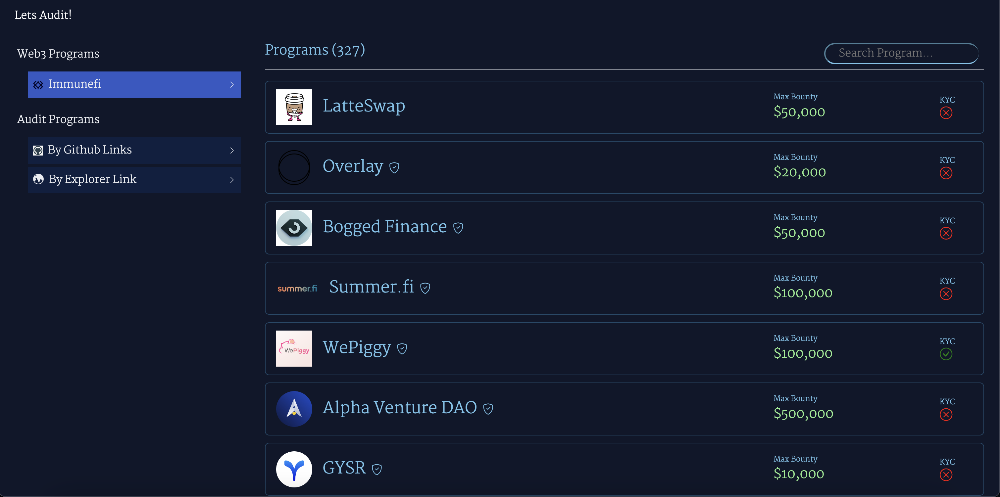
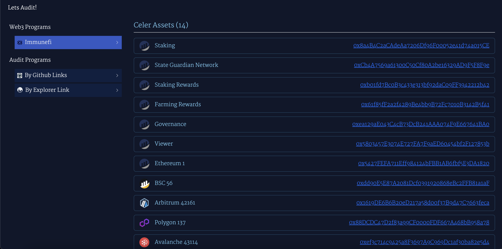
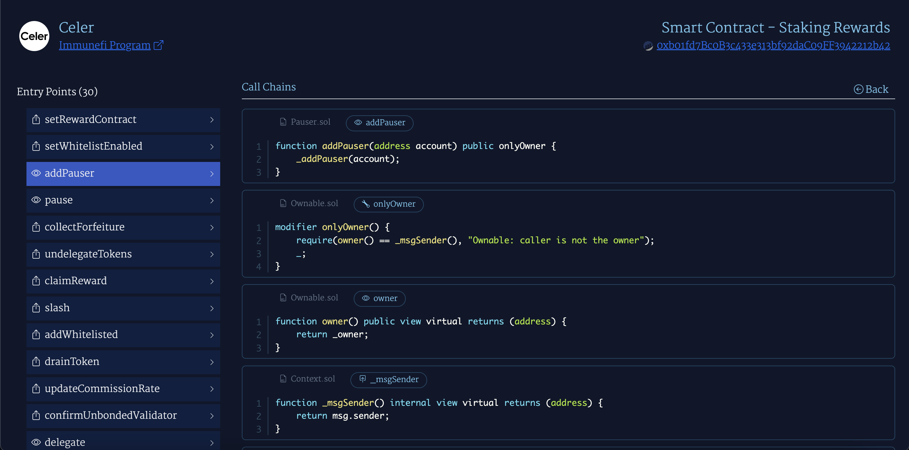
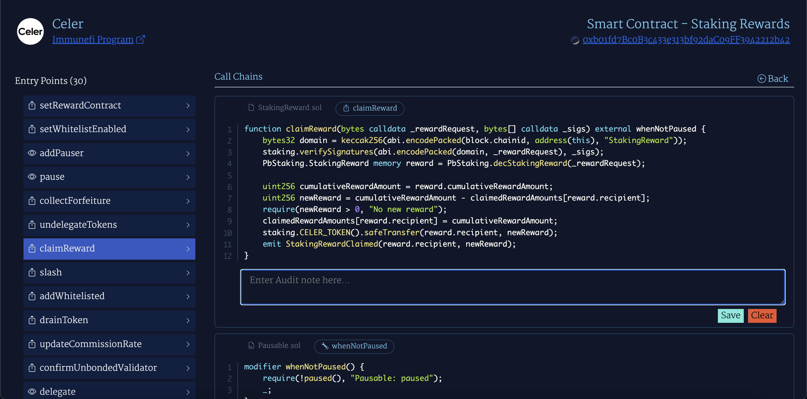
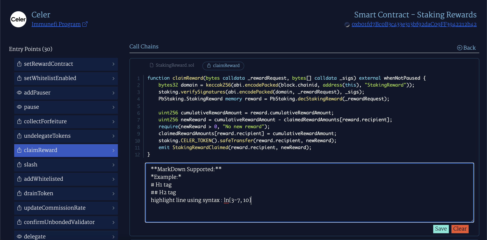
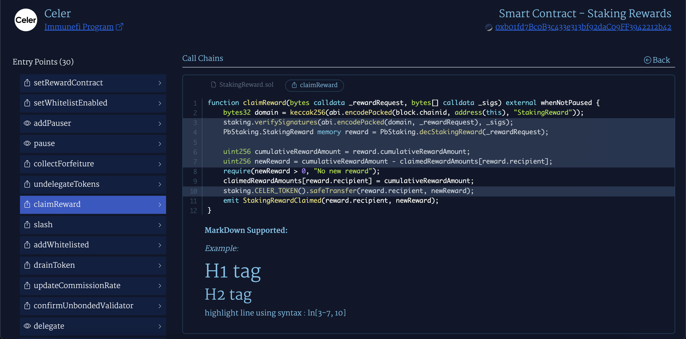
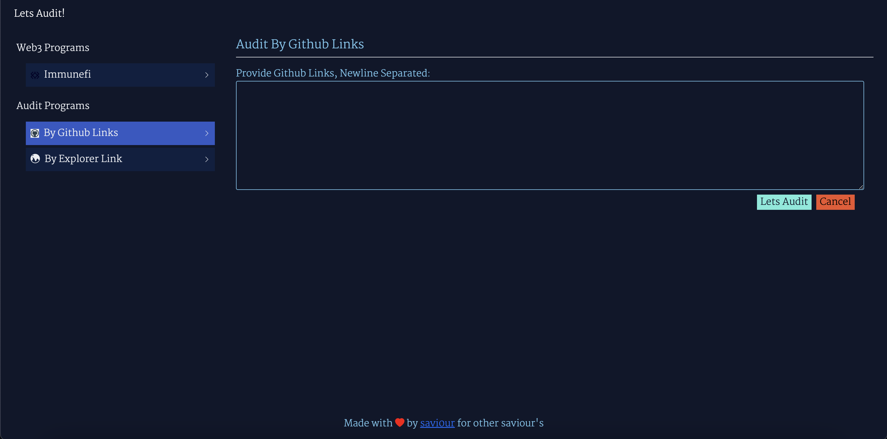
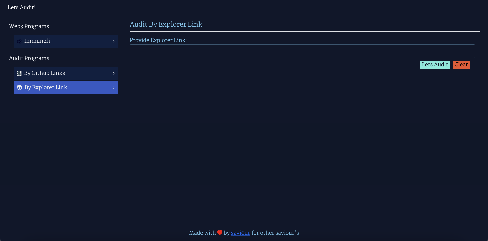

# Lets Audit

This application will help to audit any project that is on [Immunefi](https://immunefi.com/) or any project with [Github](https://github.com) links or any explorer links like [Etherscan](https://etherscan.io/), [Polygonscan](https://polygonscan.com/), [Bscscan](https://bscscan.com/), etc.

It have following features:
- display all the functions - `external` and `public` from the choosen contract links
- display all the functions/modifiers that choosen function is calling with its definition chronologically
- display input box on double click on function definition view to write audit comments
    - audit comments can be written in markdown
    - line highlight can be done by writting line numbers in comments in format : `ln[1,2,3]` OR `ln[1-3]` OR `ln[1-2,3]`, etc.

## User Interfaces

### Auditing Immunefi Projects

### Audit By Github Links

### Audit By Explorer Links

